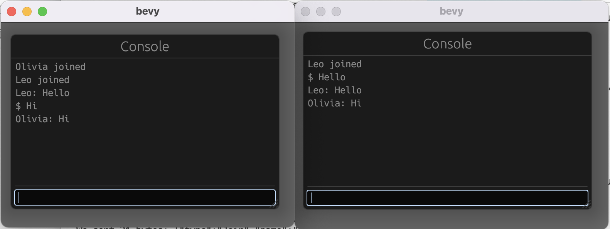

# Bevy Tokio Example

Example of using Tokio as the network layer for multiplayer in a Bevy application. This example implements a chat terminal. 



## Run

Start the server:
```shell
cargo run --release --bin bevy_tokio_example_server
```

Start a couple clients from separate terminals:
```shell
cargo run --release --bin bevy_tokio_example_client
```

Type some chat messages into one of the bevy apps and see them appear in the other!

Note: bevy_console isn't really designed to be used as a chat room, so won't accept certain chat messages and
will print `[error] invalid argument(s)` when trying to parse the message 
